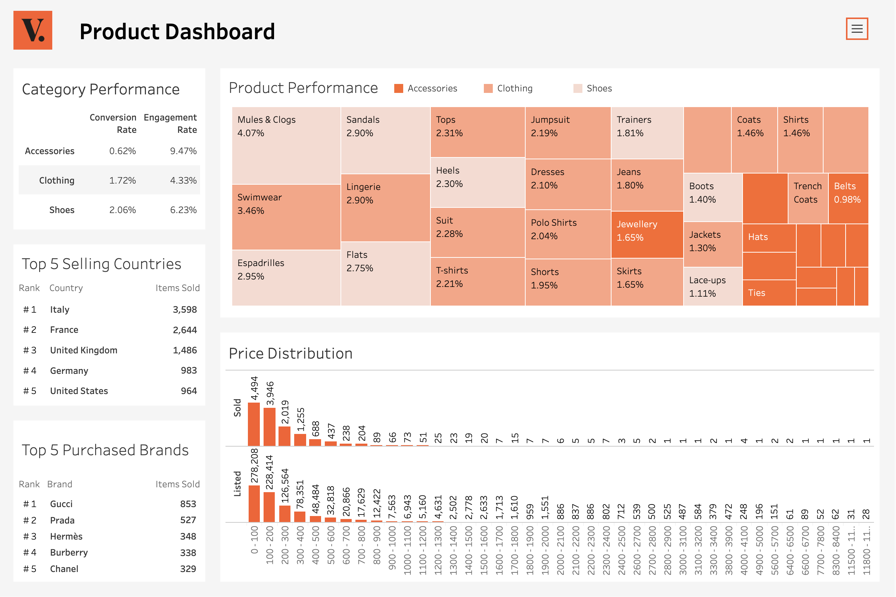

# Vestiaire Product Analysis

Analyzing Vestiaire product engagement and sales trends. Interactive Tableau dashboard can be found [here](https://public.tableau.com/app/profile/emily.hampton/viz/vestiaire/Dashboard2).

## Summary of Insights

### Performance & Engagement

- Only 1.52% of all listed products get purchased.
- Accessories get the most engagement, but also the lowest conversion to sales.
- Shoes perform the best, having the highest conversion and decent engagement.
- Products categorized as "All season" have more engagement and perform better than those categorized as "Autumn/Winter" or "Spring/Summer".
- There are over 6x more likes than listings, and likes do not translate strongly to purchases.

### Popularity

- Italy, France, Germany, the UK, and the USA make up 67.6% of all listings and of those listings 1.59% get purchased.
- Brands purchased more are in the Accessible Core or Premium Core tiers (according to Erwan Rambourg's luxury brand hierarchy).
- Brands most listed coincide with brands most purchased, however more brands within the Affordable Luxury tier are listed.
- Everyday luxury brands listed are usually athleticwear and street-style brands.

### Price

- Most purchased products are priced between $0-400.
- Listings vary drastically from $6-632,610 and averaging around $387.
- Purchases range from $15-11,822 and averaging around $239.

## Recommendations and Next Steps

- Prices range extensively, but the average between listings and purchases is relative close – investigate variables and features that could impact decision making to increase purchases.
- Address some this dataset's limitations by collecting data on buyers, dates/times, and missing categories (ex: Handbags).
